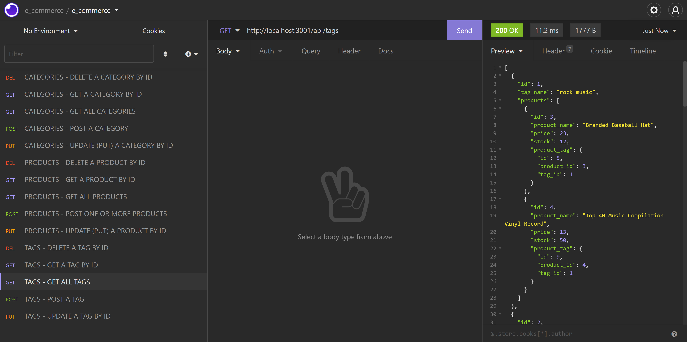

# [E-Commerce Backend](#title)

## [Description](#description)
An e-commerce backend using Express, MySQL, Sequelize, MySQL2, and dotenv to provide a full-featured CRUD platform to manage company catgeories, products, and tags.

>> - Project Repository URL: https://github.com/bkfleet1/e-commerce >> 

>> - Walkthrough Video: https://drive.google.com/file/d/1GImfXCAZMB36lTb5ZFscPUs56FDXNmBB/view

## Table of Contents
> - [Title](#title)
> - [Description](#description)
> - [Developer](#developer)
> - [Resources](#resources)
> - [Installation](#installation)
> - [Use Instructions](#usage)
> - [Tests](#tests)
> - [Questions](#questions)

## [Developer](#developer)
[Brad Kelley](mailto:bradkelleytech@gmail.com)

## [Resources](#resources)

The following resources were used in the development of this project.
> - Dotenv (version 16.0.0)
> - Express (version 4.17.3)
> - MySQL Server (version 8.0.28)
> - MySQL2 (version 2.3.3)
> - Node JS (version 16.14.0)
> - Sequelize (version 6.16.3)

## [Installation](#installation)
The following steps are required to execute the E-Commerce code.
> 1. Clone the repository located at: https://github.com/bkfleet1/e-commerce.
> 2. The application utilizes MYSQL a database, which can be deployed by opening the project in a terminal application, such as git bash, and typing **npm run schema** and pressing enter.
> 3. Rename the EXAMPLE_env file to **.env**. Next open the .env file and enter the the MySQL user and password with sufficient credentials to create, read, update, and delete database tables and data.
>>> NOTE: If you do not have MYSQL, you can download it at https://www.mysql.com/downloads/.

After installing the database, you will need to intall the following software and packages, also known as dependencies.
> 4. Install Node.js. You can download the latest version of Node.js at https://nodejs.org/en/ ;
> 5. Open the project in a terminal application, such as git bash, and install NPM. To install npm, simply type "**npm install**" and press enter. Don't close your terminal application, we have a couple more items to install;
> 6. Next install Express, which is a package that provides a local web server to enable web-pages and APIs. To install Express simply type "**npm install express**" and press enter;
> 7. Now install Sequelize, which is a package that performs promise-based transactions of application data. To install Sequelize simply type "**npm install sequelize**" and press enter;
> 8. Next install MYSQL2, which is a package that enables communication with your MYSQL database. To install MYSQL2 simply type "**npm install mysql2**" and press enter;
> 9. Finally you will need to install dotenv, which stores environmental variables in a .env file (i.e., database name, user, and password). You can install this package by typing "**npm install dotenv**" and press enter.

**NOTE: You can seed the database with test data by opening the project in a terminal application, such as git bash, and typing **npm run seed** and pressing enter.**

## [Use Instructions](#usage)
After the installation process, you are ready start the application server powered by Express. Just open the project in a terminal application, such as git bash, and type "**npm start**" and press enter. Your initialized application server should resemble the image below.

### Category CRUD Endpoints
>> - To view all categories in the application's category table, you can use a GET api call to **http://{your url}/api/categories/**.The image below illustrates this feature using seed data and running Express on a localhost (http://localhost:3001/api/catgeories/).
>>  .

>> - To view a single category in the application's category table, you can use a GET api call to **http://{your url}/api/categories/{category id]**.The image below illustrates this feature using seed data and running Express on a localhost (http://localhost:3001/api/catgeories/1).
>>  .

>> - To create a new category to the application's category table, you can use a POST api call to **http://{your url}/api/categories/**. Additionally, you must include a category_name (string) in BODY of your API call in a JSON format The image below illustrates this feature using seed data and running Express on a localhost (http://localhost:3001/api/catgeories/).
>>  .

>> - To update a single category in the application's category table, you can use a PUT api call to **http://{your url}/api/categories/{category id]**.The image below illustrates this feature using seed data and running Express on a localhost (http://localhost:3001/api/catgeories/6).
>>  .

>> - To delete a single category in the application's category table, you can use a DELETE api call to **http://{your url}/api/categories/{category id]**.The image below illustrates this feature using seed data and running Express on a localhost (http://localhost:3001/api/catgeories/6).
>>  .

### Product CRUD Endpoints
>> - To view all products in the application's product table, you can use a GET api call to **http://{your url}/api/products/**.The image below illustrates this feature using seed data and running Express on a localhost (http://localhost:3001/api/products/).
>>  .

>> - To view a single product in the application's product table, you can use a GET api call to **http://{your url}/api/products/{product id]**.The image below illustrates this feature using seed data and running Express on a localhost (http://localhost:3001/api/products/1).
>>  .

>> - To create a new product to the application's product table, you can use a POST api call to **http://{your url}/api/products/**. Additionally, you must include a product_name (string), price(string), stock(string), and, optionally,one or more tagIds (integers in an array) in the BODY of your API call in a JSON format. The image below illustrates this feature using seed data and running Express on a localhost (http://localhost:3001/api/products/
>>  .

>> - To update a single product in the application's product table, you can use a PUT api call to **http://{your url}/api/products/{product id]**. You can update one or more of the following values in the BODY of your API call in a JSON format, the product_name (string), price(string), stock(string), and, optionally,one or more tagIds (integers in an array).The image below illustrates this feature using seed data and running Express on a localhost (http://localhost:3001/api/products/6).
>>  .

>> - To delete a single product in the application's product table, you can use a DELETE api call to **http://{your url}/api/products/{product id]**.The image below illustrates this feature using seed data and running Express on a localhost (http://localhost:3001/api/products/6).
>>  .

### Tag CRUD Endpoints
>> - To view all tags in the application's tag table, you can use a GET api call to **http://{your url}/api/tags/**.The image below illustrates this feature using seed data and running Express on a localhost (http://localhost:3001/api/tags/).
>>  .

>> - To view a single tag in the application's tag table, you can use a GET api call to **http://{your url}/api/tags/{tag id]**.The image below illustrates this feature using seed data and running Express on a localhost (http://localhost:3001/api/tags/1).
>>  .

>> - To create a new tag to the application's tag table, you can use a POST api call to **http://{your url}/api/tags/**. Additionally, you must include a tag_name (string) in the BODY of your API call in a JSON format The image below illustrates this feature using seed data and running Express on a localhost (http://localhost:3001/api/tags/
>>  .

>> - To update a single tag in the application's tag table, you can use a PUT api call to **http://{your url}/api/tags/{tag id]**.The image below illustrates this feature using seed data and running Express on a localhost (http://localhost:3001/api/tags/9).
>>  .

>> - To delete a single tag in the application's tag table, you can use a DELETE api call to **http://{your url}/api/tags/{tag id]**.The image below illustrates this feature using seed data and running Express on a localhost (http://localhost:3001/api/tags/9).
>>  .

## [Tests](#tests)
No formal testing is available. However, you can seed the database with test data by opening the project in a terminal application, such as git bash, and typing **npm run seed** and pressing enter.

NOTE: Your testing environment should be different from the production environment described in the [Installation](#installation) section. You can create a test environment following [Installation](#installation) instructions, but you will need to modify the database name in your **.env** file to use your desired test database name.

>>> 1. Open a terminal application, such as git bash, and type "**mysql -u root -p**". Type in the password of your MYSQL root user;
>>> 2. Type "**use database YOUR_TEST_DATABASE_NAME;**" and press enter.
>>> 3. Type "**quit;**" and press enter to exit MSQL.
>>> 4. Type "**npm run seed**" and press enter.

## [Questions](#questions)
Please email [Brad Kelley](mailto:bradkelleytech@gmail.com) with any project questions.